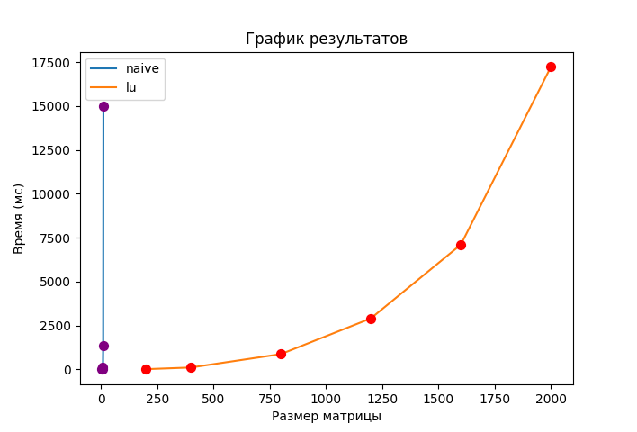

# Отчёт по лабораторной работе №1

## Введение

В данной работе необходимо было  написать программу на языке C/C++ для перемножения двух квадратных матриц. Но по желанию можно было реализовать любую  другую вычислительную задачу, которая может быть распараллелена.
**Поэтому в данном проекте идёт не перемножение матриц, а вычисление определителя матрицы.**

---

## Алгоритмы на C/C++

Сами матрицы реализованы в виде незамысловатого класса `Matrix<T>` описанного в `Matrix.h`. Там есть всё необходимое для практически любых алгоритмических задач.

Для вычисления определителя используются 2 алгоритма:

- Разложение по строке/столбцу (`naive_determinant`)
- Через LU разложение (`lu_determinant`)

### Разложение по строке/столбцу

Определитель матрицы из 1 элемента - это сам этот элемент.
Для матрицы 2x2 есть формула: `det(A) = (a11 * a22) - (a12 * a21)`
Для матриц больших порядков происходит разложение на сумму определителей матриц на 1 порядок меньше и коэффициентов разложения. В результате получается <ins>рекурсивный</ins> алгоритм.

Сложность: ***O(n!)***
Чтобы подсчитать даже матрицу `5x5` нам нужно высчитать 5\*`4x4` = 5\*4\*`3x3` =  5\*4\*3\*`2x2`. Этот алгоритм очень медленный.

### Определитель через LU разложение

Смысл заключается в том, чтобы воспользоваться свойством треугольных матриц для вычисления определителя. LU-разложение - это представление исходной матрицы `A` в виде произведения 2-х треугольных матриц `L` и `U` (нижне-треугольной и верхне-треугольной) соответственно.
Получаем равенство `A = L*U`. По свойству определителя: `det(A) = det(L)*det(U)` В свою очередь по свойству треугольной матрицы `det(L)`, `det(U)` - произведение элементов матрицы, стоящих на главной диагонали.

Сложность: ***O(n^3)***
Разложение имеет сложность `O(n^3)` Перемножение диагональных элементов - линейная операция.

---

## Ввод и вывод программы

Программа имеет 1 не именованный параметр командной строки (не обязательный) - имя файла, в котором храниться матрица для вычисления. Это необходимо для последующей верификации результатов.

Весь вывод программы осуществляется в системный потов вывода.
Там: матрица, время вычисления обоих алгоритмов и их результаты.

### Файл, содержащий матрицу

В первой строке два числа `n`, `m` - размеры матрицы
Далее - `n` строк по `m` элементов матрицы.

---

## Верификация результатов

`test.py` отвечает за проверку работы программы. Он принимает в качестве аргументов путь к исполняемому файлу программы и путь к фалу матрицы для тестирования. Через встроенную библиотеку `subprocess` скрипт вызывает исполняемый файл, передаёт ему ввод и получает вывод.
Проверка результата происходит через `numpy`. Результаты вычислений сравниваются с `numpy.linalg.det` через `np.isclose`.

---

## Тесты производительности

Пора посмотреть, как ведут себя алгоритмы с достаточно большими матрицами.
> Замечание: наивный алгоритм настолько медленный, что на матрицах >10 время расчётов улетает в стратосферу. Но для наглядности парочку результатов стоит привести.

| Размер | Время |
| --- | --- |
| 5x5 | 0.0478ms |
| 7x7 | 1.9096ms |
| 9x9 | 146.324ms |
| 10x10 | 1361.94ms |
| 11x11 | 14977.3ms |

Дальше расчёт делать смысла не имеет. Ожидаемо для алгоритма со сложностью `O(n!)`

Посмотрим, как **LU-алгоритм** справиться с *РЕАЛЬНО* большими матрицами.
> Расчёты проводились на матрицах чисел типа double (float64), числа в интервале от -0.1 до 0.1, чтобы результаты определителя не улетали в бесконечность.

Замеры взяты из вывода программы, записанного в [benchmark_lu.txt](benchmark_lu.txt)

| Размер | Время |
| --- | --- |
| 200x200 | 13.9418ms |
| 400x400 | 108.383ms |
| 800x800 | 872.297ms |
| 1200x1200 | 2905.85ms |
| 1600x1600 | 7105.09ms |
| 2000x2000 | 17225.8ms |

Для наглядности построим по этим результатам график:
