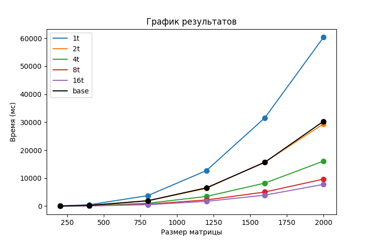

# Отчёт по лабораторной работе №3

## Введение

В данной работе необходимо было модифицировать программу из л/р №1, добавив возможность параллельной работы по технологии MPI. А также провести тесты/замеры производительности с разными конфигурациями потоков/ядер.

---

## Важное решение

После выполнения второй лабораторной работы и изучения библиотеки MPI я окончательно убедился, что мой алгоритм вычисления определителя для параллельной работы не годиться. Для MPI придётся очень сильно его переработать, практически написав с нуля. При этом прироста в производительности от параллелизации практически не будет.

Поэтому начиная с этой лабораторной реализовывать я буду стандартный алгоритм матричного умножения.

### Ещё немного про изменения

`Matrix.h` используемый как класс для хранения матриц теперь представляет их в виде одномерного массива, а не двумерного. Это изменения мало на что влияет, но очень пригодиться в оптимизации под MPI.

Кстати, сам базовый алгоритм умножения матриц (по определению) O(n^3)

```cpp
Matrix<T>& operator*=(const Matrix<T>& other) {
    if (columns_ != other.rows_) {
        throw std::logic_error("Матрицы не совместны");
    }
    Matrix<T> res(rows_, other.columns_);
    
    for (size_t i = 0; i < rows_; i++) {
        for (size_t j = 0; j < other.columns_; j++) {
            for (size_t r = 0; r < columns_; r++) {
                res.data_[i*rows_ + j] += data_[i*rows_ + r] * other.data[r*rows_ + j];
            }
        }
    }
    *this = res;
    return *this;
}
```

## Работа с MPI

Суть разделения задачи заключается в том, что умножения матриц можно представить для каждого элемента как сумму произведений. А значит произведение матриц - сумма некоторого числа матриц с промежуточными вычислениями.

В алгоритме первые два цикла по `i` и `j` - индексы элементов результирующей матрицы. Цикл по `r` - сумма произведений элементов исходных матриц. Пусть тогда каждый из потоков `MPI` проходит лишь по небольшой части этого цикла с суммой, а затем их результирующие матрицы суммируются в итоговый результат.

Для этой задачи идеально подходит функция `MPI_Reduce()`, которая способна проводить редукцию по динамическим массивам. (именно для этого было сделано изменение способа хранения матрицы)

---

## Верификация результатов

`test.py` пришлось немало изменить из-за изменения задачи. Тестируемая программа теперь запускается через вызов `mpiexec`/`mpirun` с нужным числом потоков (рабочих), также помимо результата считывается ещё и время вычислений.
Проверкой правильности вычисления занимается `numpy`: умножение матриц - `np.matmul()`, проверка равенства - `np.allclose()`

---

## Тесты производительности

Условия такие: матрица типа `double (float64)`, числа в интервале от -0.1 до 0.1
Количество потоков: 1, 2, 4, 8, 16
Для простоты эксперимента квадратная матрица просто умножается на себя (по сути возводится в квадрат)

> ***Замечание:*** Алгоритм работает для любого числа потоков, размеров и форм матриц, работа между потоками распределится почти равномерно. Такой замер используется только, чтобы сильно не усложнять задачу.

Полный вывод `test.py` находиться в [benchmark.txt](benchmark.txt)

| Размер \ Потоки | 1 поток | 2 потока | 4 потока | 8 потоков | 16 потоков |
| -- | -- | -- | -- | -- | -- |
| 200x200 | 58.25ms | 30.19ms | 15.46ms | 12.63ms | 10.18ms | 
| 400x400 | 467.07ms | 234.45ms | 124.43ms | 90.99ms | 63.45ms | 
| 800x800 | 3735.15ms | 1888.47ms | 1015.40ms | 662.98ms | 499.00ms |
| 1200x1200 | 12675.92ms | 6348.91ms | 3441.49ms | 2187.45ms | 1686.56ms |
| 1600x1600 | 31577.60ms | 15774.84ms | 8219.59ms | 5028.41ms | 3910.87ms |
| 2000x2000 | 60328.58ms | 29362.09ms | 16080.18ms | 9645.74ms | 7753.79ms |

Вот визуализация этих данных в виде графика:
для интереса добавил замеры этого же алгоритма без MPI в 1 потоке. (base)



Здесь 1t, 2t, и тд. - запуски с разным числом потоков.
