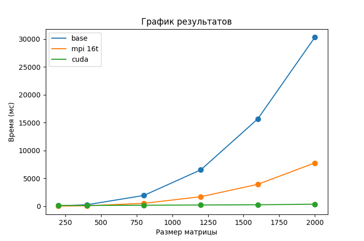
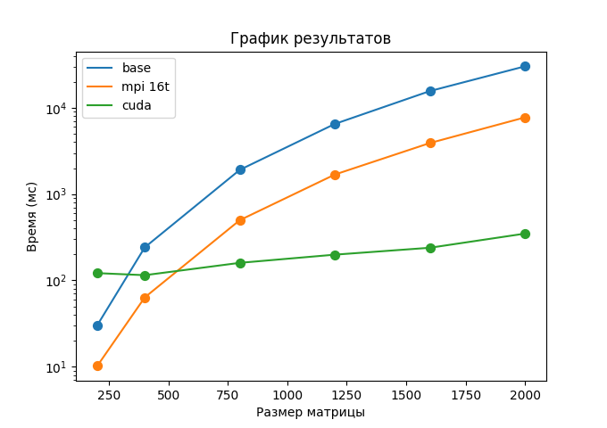

# Отчёт по лабораторной работе №4

## Введение

В данной работе необходимо было модифицировать программу из л/р №1, добавив возможность параллельной работы по технологии CUDA. А также провести тесты/замеры производительности с разными размерами матриц и различными конфигурациями сетки блоков.

---

## Работа с CUDA

Смысл прост: Если в итоговой матрице меньше, чем `512` элементов, то разбиваем только на блоки с 1 потоком в каждом. Каждая такая единица обрабатывает 1 элемент результирующей матрицы, определяемый на основе её позиции в блоке.
Для матриц большей размерности в блоках устанавливается некоторое кол-во подблоков.

---

## Тесты производительности

Условия такие: матрица типа `double (float64)`, вещественные числа в интервале от -100 до 100 (для разнообразия)
Устройство: `RTX 3060 12GB (Desktop): 3584 ядра CUDA`
Конфигурация сетки блоков - зависит от матрицы:
**N^2 <= 512:**

```cpp
<dim3(N, N), dim3(1, 1)>
```

**Иначе:**

```cpp
<dim3(512, 512), dim3(ceil(double(N)/512), ceil(double(N)/512))>
```

Полный вывод `test.py` находится в [benchmark.txt](benchmark.txt)

| Размер | Время |
| -- | -- |
| 200x200 | 121.314ms |
| 400x400 | 114.839ms |
| 800x800 | 159.647ms |
| 1200x1200 | 198.614ms |
| 1600x1600 | 238.817ms |
| 2000x2000 | 348.36ms |

Весьма впечатляющие результаты. Вот визуализация сравнения с лучшим результатом MPI и базовым вариантом без многопоточности:


И этот же график, но с логарифмической осью `y`


