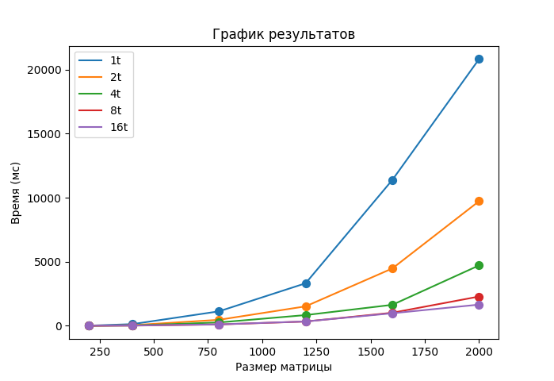

# Отчёт по лабораторной работе №5

## Введение

В данной работе необходимо было программу из л/р №3 запустить на суперкомпьютере «Сергей Королёв». А также провести тесты/замеры производительности с разными конфигурациями потоков/ядер.

---

## Верификация результатов

Пришлось внести несколько изменений в `test.py` чтобы он мог работать на суперкомпьютере:

- Во первых, библиотеки `numpy` установлено не оказалось, поэтому верификацию результатов по сути пришлось вырезать. (Это никак не должно повлиять т.к. программа уже считает верно)
- Во вторых, на суперкомпьютере установлена версия Python 3.6.x, из-за чего пришлось адаптировать часть кода под неё.

---

## Тесты производительности

Условия такие: матрица типа `double (float64)`, числа в интервале от -0.1 до 0.1
Количество потоков: 1, 2, 4, 8, 16
Параметр `--ntasks-per-node` = 8

Полный вывод выполнения задачи находиться в [slurm-252227.txt](slurm-252227.txt)

| Размер \ Потоки | 1 поток | 2 потока | 4 потока | 8 потоков | 16 потоков |
| -- | -- | -- | -- | -- | -- |
| 200x200 | 11.02ms | 5.40ms | 3.17ms | 2.18ms | 5.48ms |
| 400x400 | 127.90ms | 47.75ms | 25.02ms | 13.54ms | 21.75ms |
| 800x800 | 1125.93ms | 466.31ms | 260.69ms | 103.21ms | 109.82ms |
| 1200x1200 | 3317.00ms | 1516.51ms | 835.35ms | 333.17ms | 336.33ms |
| 1600x1600 | 11383.10ms | 4474.65ms | 1636.33ms | 1017.22ms | 976.25ms |
| 2000x2000 | 20816.10ms | 9723.53ms | 4712.68ms | 2283.65ms | 1652.87ms |

Вот визуализация этих данных в виде графика:
для интереса добавил замеры этого же алгоритма без MPI в 1 потоке. (base)

Здесь 1t, 2t, и тд. - запуски с разным числом потоков.
